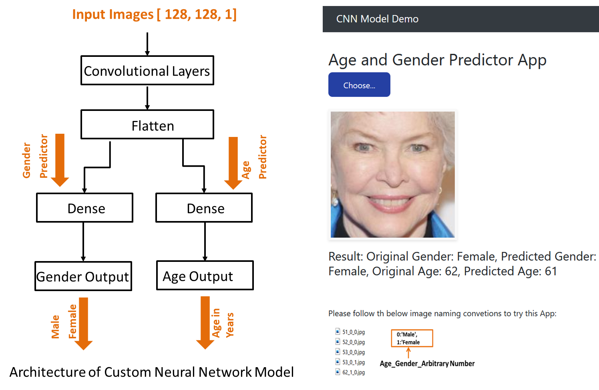

# Age and Gender Predictor App <br />
This project is about creating a deep learning (DL) end to end flask web app for predciting age and gender. I used deep convolutional neural networks (CNN) which is mainly used for applications in image and speech recognition to build my model on UTKFace dataset. And finally I deployed the model with Flask on localhost and Heroku platform (PaaS).

UTKFace dataset is a large-scale face dataset with long age span (range from 0 to 116 years old). The dataset consists of over 20,000 face images with annotations of age, gender, and ethnicity. To overcome the challenge of memory limitations, I resized, normalized and descaled the images to single-channel images. 

```

```

